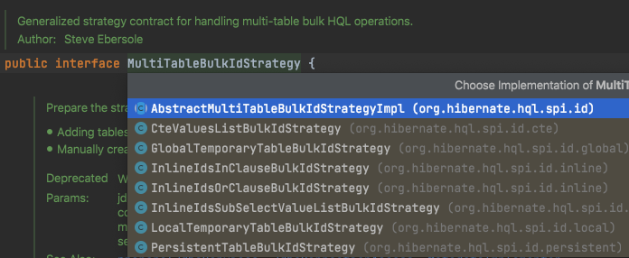

# Hibernate inheritance bulk-id strategies
Hibernate에서 JOINED Inheritance Strategy를 사용한 경우 batch delete 구현 방법을 다뤄봅니다. Reference에 있는 Hibernate post를 보시면 좀더 상세한 글을 확인할 수 있습니다.

* 테스트 환경
  * H2 DB
  * MySQL 5.7.24

## class 상속 구성
Person 클래스를 상속하는 Doctor, Student가 있습니다. 실무 경험 상 JOINED Inheritance를 많이 사용하게 되는 것 같습니다.

```kotlin
@Entity(name = "person")
@Inheritance(strategy = InheritanceType.JOINED)
open class PersonEntity(
    @Id
    @GeneratedValue(strategy = GenerationType.IDENTITY)
    val id: Long? = null,

    @Column(nullable = false)
    var name: String,

    @Column(nullable = false)
    var employed: Boolean,
)

@Entity(name = "doctor")
class DoctorEntity(
    id: Long,
    name: String,
    employed: Boolean,
    @Column(nullable = false)
    val major: String,
) : PersonEntity(id, name, employed)

@Entity(name = "student")
class StudentEntity(
    id: Long,
    name: String,
    employed: Boolean,
    var creditAverage: Double,
) : PersonEntity(id, name, employed)
```

## bulk deletion
아래처럼 쿼리문을 작성하면 batch delete를 수행하는데요. 이렇게 부모 클래스를 타겟으로 작성하면 bulk-id delete를 수행하게 됩니다. 
```kotlin
entityManager.createQuery("delete from person where employed = :employed")
    .setParameter("employed", false)
    .executeUpdate()
```

### H2 테스트 결과 로그
```
// HT_person 테이블 생성 후 조회된 identifier 삽입
Hibernate: create cached local temporary table if not exists HT_person (id bigint not null) on commit drop transactional
Hibernate: insert into HT_person select personenti0_.id as id from person personenti0_ where personenti0_.employed=?
// batch delete 시작
Hibernate: delete from student where (id) IN (select id from HT_person)
Hibernate: delete from doctor where (id) IN (select id from HT_person)
Hibernate: delete from person where (id) IN (select id from HT_person)
Hibernate: delete from HT_person
```
Hibernate에서는 상속 관계에서 최적화를 위해 HT_를 prefix로 하는 identifier holding 용도의 임시 테이블을 생성하는 것이 기본 전략입니다. (global temporary table)
실제로 수행되는 쿼리들을 살펴보면 HT_person 임시 테이블을 만든 다음 테이블 갯수 만큼의 bulk delete를 수행하는 것을 볼 수 있습니다.
마지막으로 임시 테이블을 삭제하면서 끝나네요.

```java
// H2Dialect.class
public MultiTableBulkIdStrategy getDefaultMultiTableBulkIdStrategy() {
    return new LocalTemporaryTableBulkIdStrategy(new IdTableSupportStandardImpl() {
        public String getCreateIdTableCommand() {
            return "create cached local temporary table if not exists";
        }

        public String getCreateIdTableStatementOptions() {
            return "on commit drop transactional";
        }
    }, AfterUseAction.CLEAN, TempTableDdlTransactionHandling.NONE);
}
```
`create cache local temporary table ~`은 H2Dialect에 포함되어 있음을 확인할 수 있습니다.

### mysql 테스트 결과 로그
실제 mysql(5.7.24)에서도 global temporary table 전략은 잘 돌아가는 것을 확인헀습니다.
다만 데이터가 존재하지 않아도 delete 쿼리들은 항상 수행이 되네요.

```
Hibernate: create temporary table if not exists HT_person (id bigint not null) 
Hibernate: insert into HT_person select personenti0_.id as id from person personenti0_ where personenti0_.employed=?
Hibernate: delete from student where (id) IN (select id from HT_person)
Hibernate: delete from doctor where (id) IN (select id from HT_person)
Hibernate: delete from person where (id) IN (select id from HT_person)
Hibernate: drop temporary table HT_person
```

## 임시 테이블을 만들 수 없는 경우 선택 가능한 방법 
만약 DBMS에서 [HHH-11262 - Insufficient Privilege](https://hibernate.atlassian.net/browse/HHH-11262) 등의 이유로 임시 테이블을 생성할 수 없을 때 사용가능한 전략 4가지가 있습니다.
다만 'IN' 절을 사용하는 전략은 Composite Identifiers만 지원하므로 PostgreSQL에서만 지원된다고 하네요.
실제로 사용하시는 DBMS에서 지원하는 전략을 선택해서 활용하시면 될 것 같습니다. 전략과 DBMS 궁합은 Reference 링크를 참고해주세요.

* InlineIdsInClauseBulkIdStrategy : PostgreSQL에서만 작동
* InlineIdsSubSelectValueListBulkIdStrategy : PostgreSQL에서만 작동
* InlineIdsOrClauseBulkIdStrategy : Oracle, SQL Server, MySQL, and PostgreSQL 모두 작동한다는 장점이 있음.
* CteValuesListBulkIdStrategy : CTE(Common Table Expressions) 지원해야하며 PostgreSQL에서만 작동

<br>
위 전략들은 모두 MultiTableBulkIdStrategy을 구현(implementation)하고 있습니다.


### InlineIdsInClauseBulkIdStrategy
Composite Identifiers가 아니다보니 H2 DB와 제 로컬 mysql 모두 아래처럼 UnsupportedOperationException이 발생해서 사용할 수 없네요.
```
The InlineIdsIdsInClauseDeleteHandlerImpl can only be used with Dialects that support IN clause row-value expressions (for composite identifiers)!
```

### InlineIdsSubSelectValueListBulkIdStrategy
InlineIdsInClauseBulkIdStrategy와 마찬가지로 Composite Identifiers가 아니여서 동작하지 않습니다.

### InlineIdsOrClauseBulkIdStrategy
아래처럼 select로 먼저 조건을 만족하는 id를 찾은 이후 delete를 수행하는 것을 확인할 수 있습니다.
만약 select 결과가 존재하지 않는다면 delete문은 수행하지 않는 것을 확인했습니다.

```
Hibernate: select personenti0_.id as id from person personenti0_ where personenti0_.employed=?
Hibernate: delete from student where (id = 2) or (id = 3)
Hibernate: delete from doctor where (id = 2) or (id = 3)
Hibernate: delete from person where (id = 2) or (id = 3)
```

### CteValuesListBulkIdStrategy
MySQL5InnoDBDialect에서는 CTE가 지원되지 않아서 역시 UnsupportedOperationException이 발생하네요.
그런데 reference를 보니 역시 'IN' 절을 사용하기 때문에 PostgreSQL에서만 작동한다고 합니다. 
```
UnsupportedOperationException: The CteValuesListDeleteHandlerImpl can only be used with Dialects that support CTE that can take UPDATE or DELETE statements as well!
```

## reference
* Hibernate post: https://in.relation.to/2017/02/01/non-temporary-table-bulk-id-strategies/

